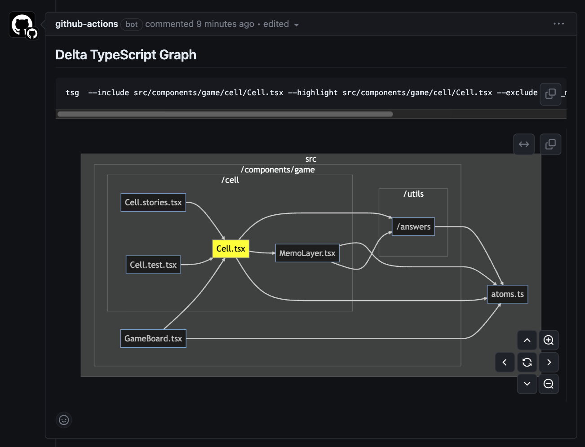
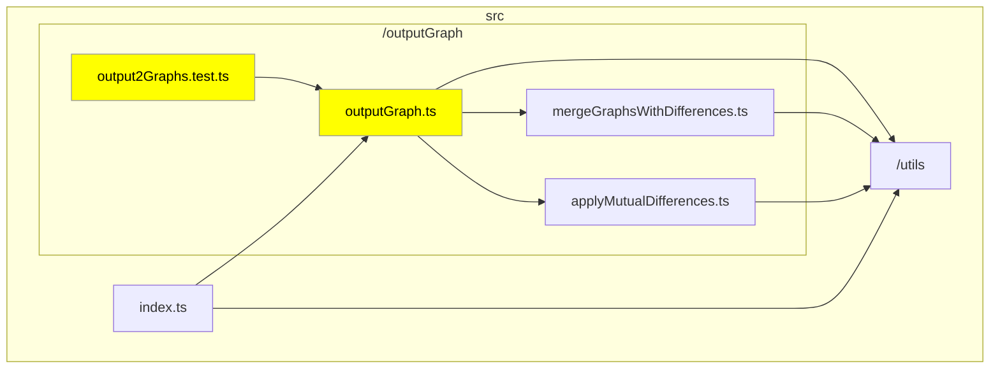
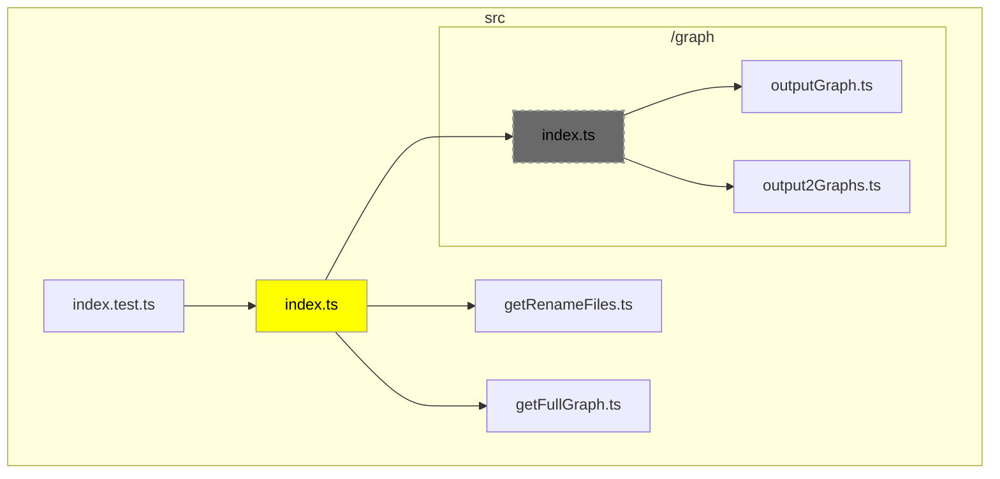
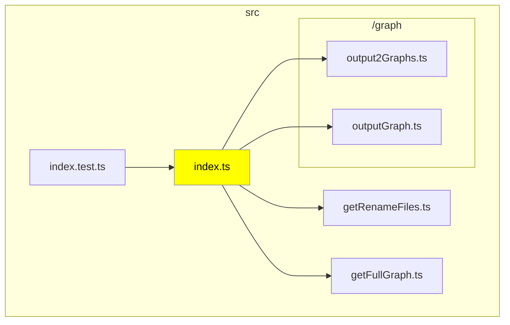

# Delta TypeScript Graph Action

This GitHub Action uses Mermaid to visualize in a diagram the files that were changed in a Pull Request and their related dependency files. This approach aims to reduce the initial cognitive load during the review process and assist in understanding the structure around the modified code.



## Sample Usage

### Basic File Modifications

In this example, we show the dependency graph when you've modified `outputGraph.ts` and its related test files. The modified files are highlighted in yellow, and the files they depend on are also explicitly displayed on the graph.



### Changes Involving File Deletion or Movement

This case demonstrates the impact when a file is deleted or moved. Dependency graphs are generated for both the base branch and the head branch. Deleted files are displayed in a grayed-out manner.

#### Base Branch



#### Head Branch



## Getting Started

To quickly integrate this Action into your workflow, you can use the following minimal YAML configuration. This setup is sufficient to start using the Action with its default settings on pull request events.

```yml
on: pull_request

# Sets permissions of the GITHUB_TOKEN to allow write pull-requests
permissions:
  pull-requests: write

jobs:
  delta-typescript-graph-job:
    runs-on: ubuntu-latest
    name: Delta TypeScript Graph
    steps:
      - name: Checkout
        uses: actions/checkout@b4ffde65f46336ab88eb53be808477a3936bae11 # specify latest version
      - uses: ysk8hori/delta-typescript-graph-action@v # specify latest version
```

This basic setup will trigger the Action on every pull request. The Action will run on the latest Ubuntu runner and use its default settings. If you want to customize the Action, you can add parameters under the `with` section of the workflow file.

## Configuration

This Action provides several parameters to customize its behavior. You can specify these parameters in your GitHub Actions workflow file.

| Parameter                         | Type         | Default Value            | Description                                                                                                                |
| --------------------------------- | ------------ | ------------------------ | -------------------------------------------------------------------------------------------------------------------------- |
| `access-token`                    | `string`     | `${{ github.token }}`    | Access token for the repo.                                                                                                 |
| `tsconfig-root`                   | `string`     | `'./'`                   | **Deprecated**: Specifies the root directory where tsconfig will be searched. Ignored if `tsconfig` is specified.          |
| `tsconfig`                        | `string`     |                          | Relative path from the codebase root to the tsconfig file to be used for TypeScript Graph analysis.                        |
| `max-size`                        | `number`     | `30`                     | Limits the number of nodes to display in the graph when there are many changed files.                                      |
| `orientation`                     | `TB` or `LR` | `'TB'`                   | Specifies the orientation (`TB` or `LR`) of the graph. Note: Mermaid may produce graphs in the opposite direction.         |
| `debug`                           | `boolean`    | `false`                  | Enables debug mode. Logs will be output in debug mode.                                                                     |
| `in-details`                      | `boolean`    | `false`                  | Specifies whether to enclose Mermaid in a `<details>` tag for collapsing.                                                  |
| `exclude`                         | `string`     | `'node_modules, test'`   | Specifies a comma-separated list of files to exclude from the graph.                                                       |
| `include-index-file-dependencies` | `boolean`    | `false`                  | Determines whether to display dependency files when the changed file is referenced from an index.ts in the same directory. |
| `comment-title`                   | `string`     | `Delta TypeScript Graph` | Specifies the title of the comment posted on the PR. Useful for distinguishing analyses in monorepos or multiple CI runs.  |
| `show-metrics`                    | `boolean`    | `false`                  | Specifies whether to calculate and display metrics for the graph.                                                          |

To use these parameters, include them under the `with` section of your workflow file when using this Action. For example:

```yml
steps:
  - uses: ysk8hori/delta-typescript-graph-action@v # specify latest version
    with:
      access-token: ${{ secrets.GITHUB_TOKEN }}
      tsconfig: './my-app/tsconfig.json'
      max-size: 20
      orientation: 'LR'
      debug: true
      in-details: true
      exclude: 'node_modules, test'
      include-index-file-dependencies: true
      show-metrics: true
```

This configuration will set up the Action with the specified parameters, allowing you to customize its behavior according to your project's needs.

## About the `tsg` Command

Using the `tsg` command found in the comments generated by this action, you can achieve results similar to the graphs produced by this action. Modifying the arguments of the `tsg` command may also yield better results.

For more information about the `tsg` command, please refer to the following repository:
https://github.com/ysk8hori/typescript-graph

## About the metrics

This is a beta feature for measuring code metrics, including the Maintainability Index and Cognitive Complexity, among others.  
While these metrics are widely recognized, their accuracy in TypeScript-specific contexts may vary.  
Nonetheless, they can serve as helpful indicators for evaluating code quality.

For more details, please refer to the TypeScript Graph README:  
[TypeScript Graph README](https://github.com/ysk8hori/typescript-graph)
