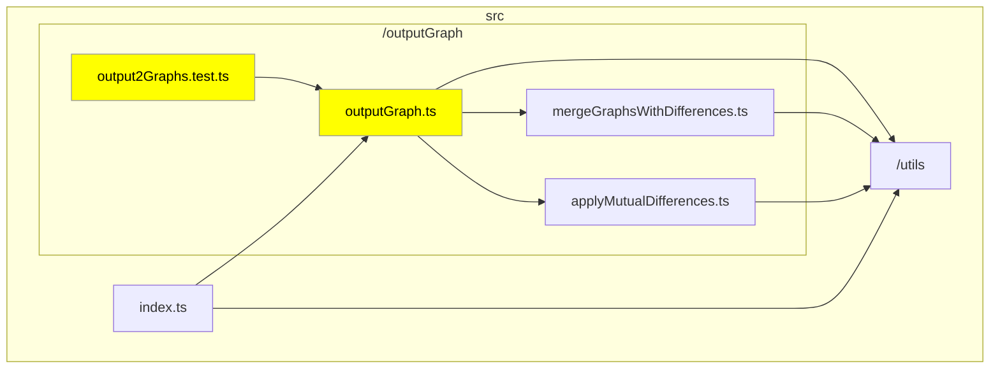
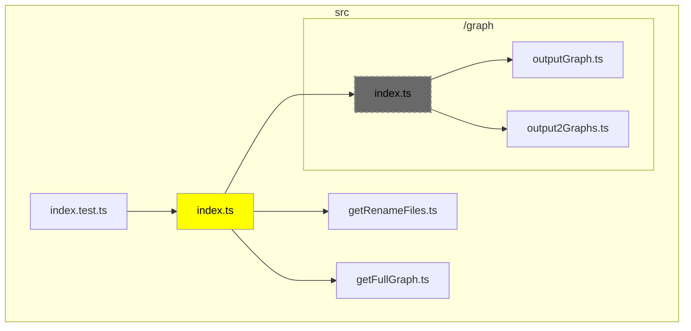
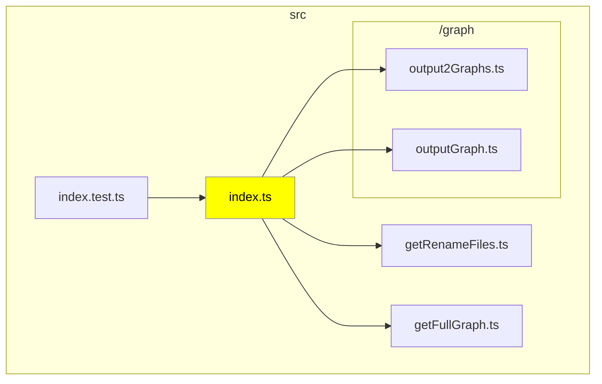

# typescript-graph-action

TODO: delta-typescript-graph-action に変える

TODO: 日本語版ドキュメント作る

This Action visualizes changes in file dependencies within the TypeScript codebase that occur in Pull Requests.

### Sample Usage

#### Basic File Modifications

In this example, we show the dependency graph when you've modified `outputGraph.ts` and its related test files. The modified files are highlighted in yellow, and the files they depend on are also explicitly displayed on the graph.

#### Changes Involving File Deletion or Movement

This case demonstrates the impact when a file is deleted or moved. Dependency graphs are generated for both the base branch and the head branch. Deleted files are displayed in a grayed-out manner.

##### Base Branch

##### Head Branch

## Configuration

TODO: ワークフローのパラメータを使用する場合の説明に変える

The `.danger-tsgrc.json` is a configuration file that stores settings in JSON format. If the relevant configuration file does not exist, or if it is in an invalid format, the default settings will be applied.
Each configuration item has a corresponding environment variable, which takes precedence over the settings in the configuration file.

| Configuration Item                | Details                                                                           | Type         | Default Value | Description                                                                                                               |
| --------------------------------- | --------------------------------------------------------------------------------- | ------------ | ------------- | ------------------------------------------------------------------------------------------------------------------------- |
| Root directory for tsconfig       | Env: `TSG_TSCONFIG_ROOT` Key: `tsconfigRoot`                                   | `string`     | `"./"`        | Specifies the directory where tsconfig will be searched.                                                                  |
| Maximum Node Count                | Env: `TSG_MAX_SIZE` Key: `maxSize`                                             | `number`     | `30`          | Specifies the value to limit graph display when the number of changed files is large.                                     |
| Graph Orientation                 | Env: `TSG_ORIENTATION` Key: `orientation`                                      | `TB` or `LR` | Not specified | Specifies the orientation (`TB` or `LR`) of the graph. However, Mermaid may produce graphs in the opposite direction.     |
| Debug Mode                        | Env: `TSG_DEBUG` Key: `debug`                                                  | `boolean`    | `false`       | Specifies whether to enable debug mode. Logs will be output in debug mode.                                                |
| Enclose in `
` tag        | Env: `TSG_IN_DETAILS` Key: `inDetails`                                         | `boolean`    | `true`        | Specifies whether to enclose Mermaid in a `
` tag and collapse it.                                                |
| Exclude Files                     | Env: None Key: `exclude`                                                       | `string[]`   | `[]`          | Specifies the files to be excluded from the graph.                                                                        |
| Display index.ts Dependency Files | Env: `TSG_INCLUDE_INDEX_FILE_DEPENDENCIES` Key: `includeIndexFileDependencies` | `boolean`    | `false`       | Specifies whether to display dependency files when the changed file is referenced from an index.ts in the same directory. |
