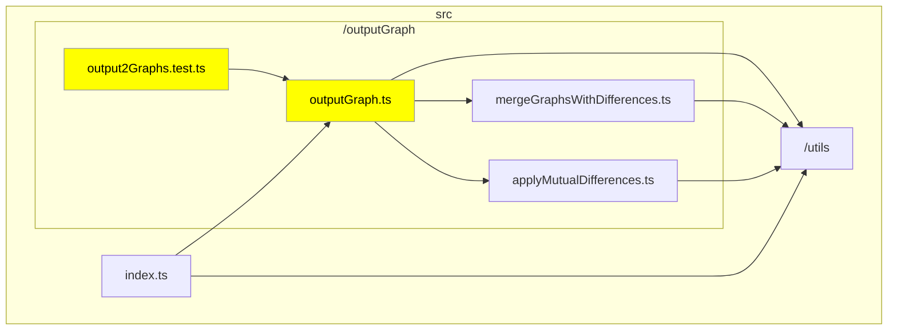
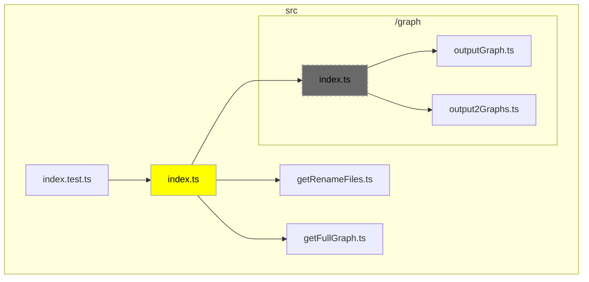
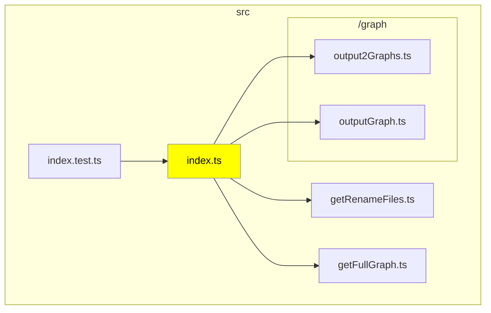

# Delta TypeScript Graph Action

TODO: delta-typescript-graph-action に変える

TODO: 日本語版ドキュメント作る

This Action visualizes changes in file dependencies within the TypeScript codebase that occur in Pull Requests.

### Sample Usage

#### Basic File Modifications

In this example, we show the dependency graph when you've modified `outputGraph.ts` and its related test files. The modified files are highlighted in yellow, and the files they depend on are also explicitly displayed on the graph.



#### Changes Involving File Deletion or Movement

This case demonstrates the impact when a file is deleted or moved. Dependency graphs are generated for both the base branch and the head branch. Deleted files are displayed in a grayed-out manner.

##### Base Branch



##### Head Branch



## Configuration

This Action provides several parameters to customize its behavior. You can specify these parameters in your GitHub Actions workflow file.

| Parameter                         | Type         | Default Value          | Description                                                                                                                |
| --------------------------------- | ------------ | ---------------------- | -------------------------------------------------------------------------------------------------------------------------- |
| `access-token`                    | `string`     | `${{ github.token }}`  | Access token for the repo.                                                                                                 |
| `tsconfig-root`                   | `string`     | `'./'`                 | Specifies the root directory where tsconfig will be searched.                                                              |
| `max-size`                        | `number`     | `30`                   | Limits the number of nodes to display in the graph when there are many changed files.                                      |
| `orientation`                     | `TB` or `LR` | `'TB'`                 | Specifies the orientation (`TB` or `LR`) of the graph. Note: Mermaid may produce graphs in the opposite direction.         |
| `debug`                           | `boolean`    | `false`                | Enables debug mode. Logs will be output in debug mode.                                                                     |
| `in-details`                      | `boolean`    | `false`                | Specifies whether to enclose Mermaid in a `<details>` tag for collapsing.                                                  |
| `exclude`                         | `string`     | `'node_modules, test'` | Specifies a comma-separated list of files to exclude from the graph.                                                       |
| `include-index-file-dependencies` | `boolean`    | `false`                | Determines whether to display dependency files when the changed file is referenced from an index.ts in the same directory. |

To use these parameters, include them under the `with` section of your workflow file when using this Action. For example:

```yml
steps:
  - uses: ysk8hori/delta-typescript-graph-action@v1.0.0
    with:
      access-token: ${{ secrets.GITHUB_TOKEN }}
      tsconfig-root: './src'
      max-size: 20
      orientation: 'LR'
      debug: true
      in-details: true
      exclude: 'node_modules, test'
      include-index-file-dependencies: true
```

This configuration will set up the Action with the specified parameters, allowing you to customize its behavior according to your project's needs.
