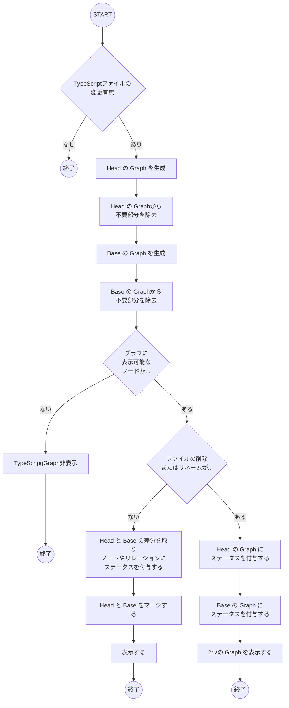

# 設計

- ❓ なぜ Head と Base の Graph 生成を並行処理しないか
  - 👨🏻‍🎓 それぞれのブランチをチェックアウトする必要があるため排他的になる
- ❓ なぜ 1 つの Graph と 2 つの Graph が必要なのか
  - 👨🏻‍🎓 その PR での構造の変化の度合いによって、1 つの Graph で見るほうが理解が容易か、2 つの Graph （Before - After）で見るほうが理解が容易かが異なるため
